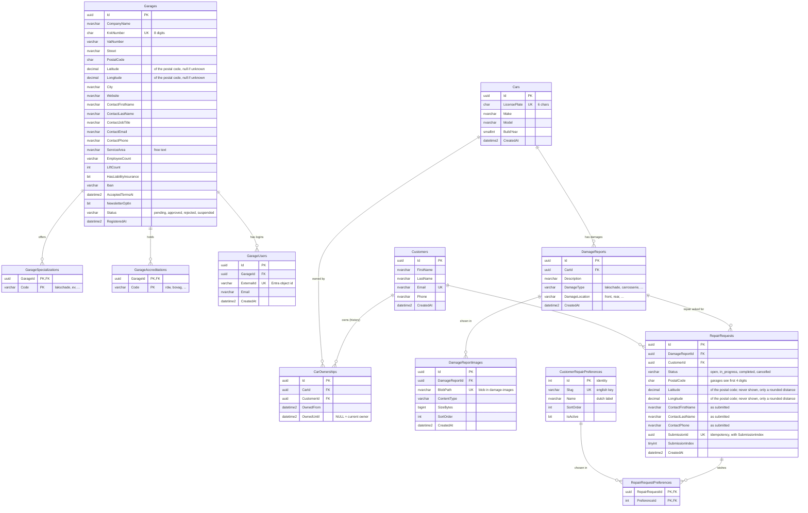

# Database schema

Current state after migrations 001–004 (`db/migrations`). Azure SQL Database / SQL Server; keys are `UNIQUEIDENTIFIER`
with `NEWSEQUENTIALID()` unless noted. The diagram renders on GitHub and in VS Code (Markdown preview with Mermaid support).

## Notes

- **Not in the diagram:** `dbo.SchemaMigrations` (bookkeeping for `npm run migrate`).
- **Garages and customers are separate worlds.** Garage-side tables (`Garages`, `GarageUsers`, ...) link to customer-side data only through
  `RepairRequests`, and only via the API, which exposes no `Customers` data and no license plate to garages.
- **Ownership is history, requests are snapshots.** `RepairRequests.CustomerId` is the customer at submission time (with the contact
  details typed on that request), while `CarOwnerships` tracks who owns the car over time (one current owner per car, enforced by a
  filtered unique index on `CarId WHERE OwnedUntil IS NULL`).
- **Images are not in the database.** `DamageReportImages.BlobPath` points to a blob in the private `damage-images` container.
- **Idempotent submissions.** `UX_RepairRequests_Submission` is a unique index on `(SubmissionId, SubmissionIndex)`; a retried submission
  returns the original requests.
- **Planned changes** (offers, status history, lookup tables, GDPR, ...) are listed in `TODO.md`.
